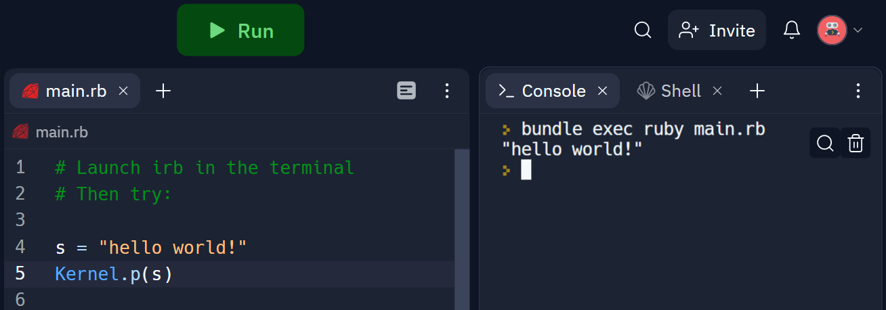

# Replace with lesson title

Add your content here!

[Read up here for full instructions with examples for lesson writing.](https://firstdraft.com/lessons/799-platform-overview)

## Heading 1

Use `##` second or greater level headings (HTML `<h2>` and greater).

### Heading 1.1

Reference images from the `assets/` folder like so:

```

```

You can use the path `/assets/my-image.png` or `assets/my-image.png`, both will render in your local markdown preview; and when you connect the repository with a Learn Lesson, the assets will upload to Cloudinary and the paths will automatically be converted to a hosted URL, e.g.:

```

```

## Time Taken

---

- Approximately how long (in minutes) did this lesson take you to complete?
{: .free_text_number #time_taken title="Time taken" points="1" answer="any" }
